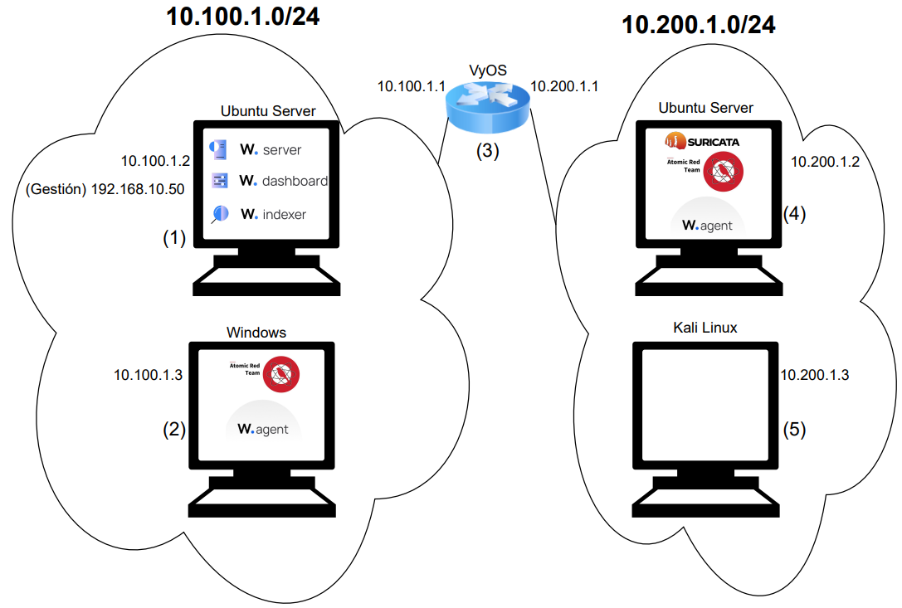

# Despliegue de un escenario de 2 redes LAN en Proxmox VE mediante Terraform
Este es el resultado del Trabajo Fin de Grado "Desarrollo de un entorno de red virtual para la implementación y evaluación de un SIEM" realizado por Antonio David Sánchez Molina, estudiante del Grado en Ingeniería de Tecnologías de Telecomunicación en la Universidad de Granada.

Mediante estos archivos es posible hacer un despliegue del siguiente escenario en Proxmox VE mediante la herramienta IaC Terraform: 

Este escenario presenta 2 redes LAN y sobre el mismo, se instala el SIEM Wazuh (servidor, indexador, dashboard, agentes...) mediante conexiones SSH desde Terraform a las máquinas virtuales desplegadas. Adicionalmente, se implementa la herramienta IDS/IPS Suricata, así como, la herramienta de simulación de técnicas de ataque Atomic Red Team, tanto en la máquina Windows como en la máquina Ubuntu Server. Cabe destacar que, la creación de las máquinas se realiza a partir de plantillas preconfiguradas.

Asimismo, se encuentra implementado un recurso que permite la notificación mediante un bot de Telegram cuando el despliegue haya finalizado.
